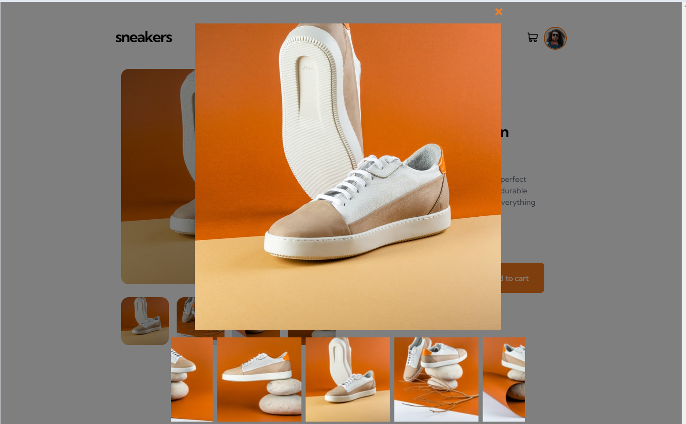
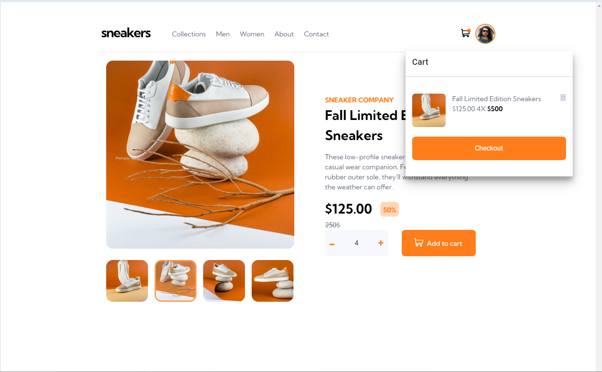
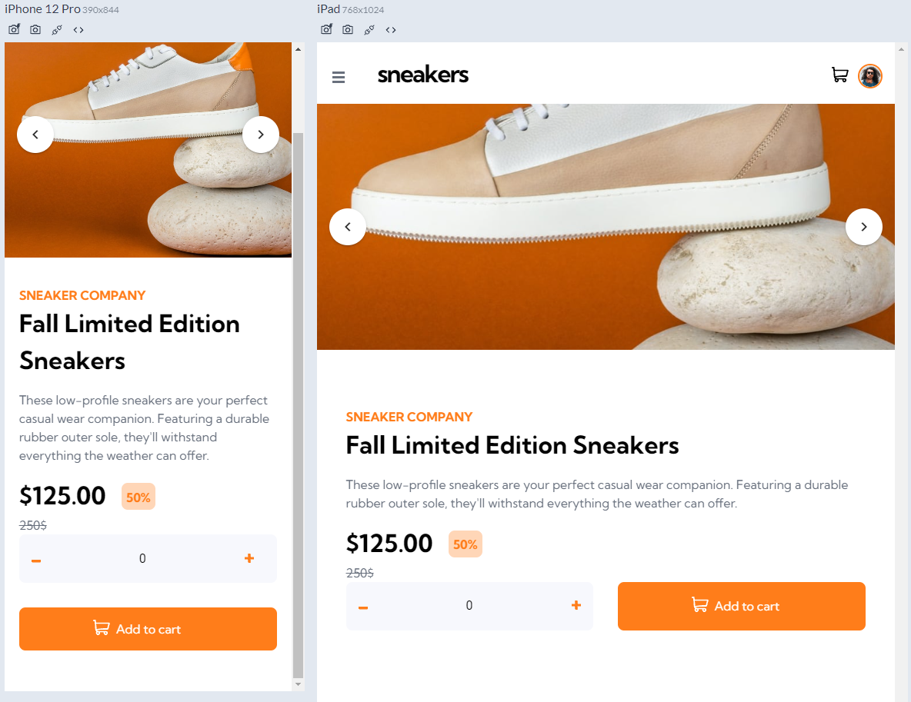

# Frontend Mentor - E-commerce product page

This is a solution to the [E-commerce product page challenge on Frontend Mentor](https://www.frontendmentor.io/challenges/ecommerce-product-page-UPsZ9MJp6). Frontend Mentor challenges help you improve your coding skills by building realistic projects.

- [Overview](#overview)
  - [The challenge](#the-challenge)
  - [Screenshot](#screenshot)
  - [Links](#links)
- [My process](#my-process)
  - [Built with](#built-with)

## Overview

### The challenge

Users should be able to:

- View the optimal layout for the site depending on their device's screen size
- See hover states for all interactive elements on the page
- Open a lightbox gallery by clicking on the large product image
- Switch the large product image by clicking on the small thumbnail images
- Add items to the cart
- View the cart and remove items from it

### Screenshot






### Links

- Live Site URL: [Add live site URL here](https://ecommerce-product-page-lime.vercel.app/)

## My process

### Built with

- Semantic HTML5 markup
- CSS custom properties
- Flexbox
- CSS Grid
- vuetify3
- [vue3](https://vue.org/) - JS library

# essentials

## Project setup

```
# yarn
yarn

# npm
npm install

# pnpm
pnpm install
```

### Compiles and hot-reloads for development

```
# yarn
yarn dev

# npm
npm run dev

# pnpm
pnpm dev
```

### Compiles and minifies for production

```
# yarn
yarn build

# npm
npm run build

# pnpm
pnpm build
```

### Lints and fixes files

```
# yarn
yarn lint

# npm
npm run lint

# pnpm
pnpm lint
```

### Customize configuration

See [Configuration Reference](https://vitejs.dev/config/).
